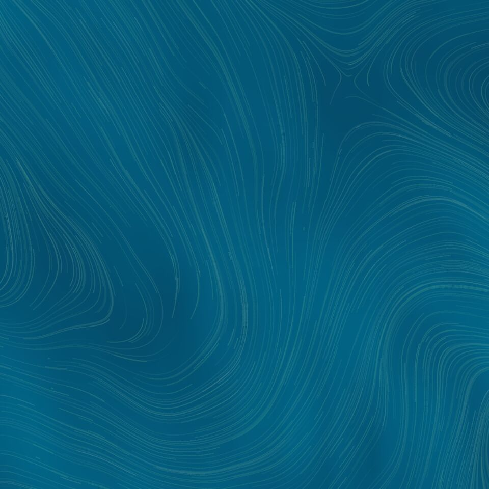
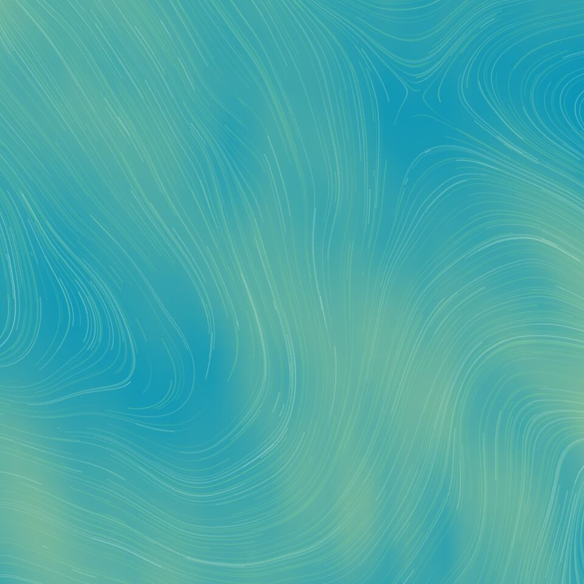

<h1 align="center">Windy Live Wallpaper</h1>

**Android live wallpaper visualizing local wind patterns.**

Shaders and basic rendering logic are based on the official Pixel windy live wallpaper, but this also has:

- More color schemes.
- Updated wind data (the official data was last updated in 2019).
- Better location handling.
- Lower memory and CPU usage.
- Modernized code, updated libGDX.
- Other fixes.

[**`Download Latest Build`**](https://nightly.link/pgaskin/windy/workflows/ci/master/app-debug)

#### Screenshots

<table><tbody><tr>
<td></td>
<td></td>
<td></td>
<td></td>
<td></td>
<td></td>
<td></td>
</tr></tbody></table>
