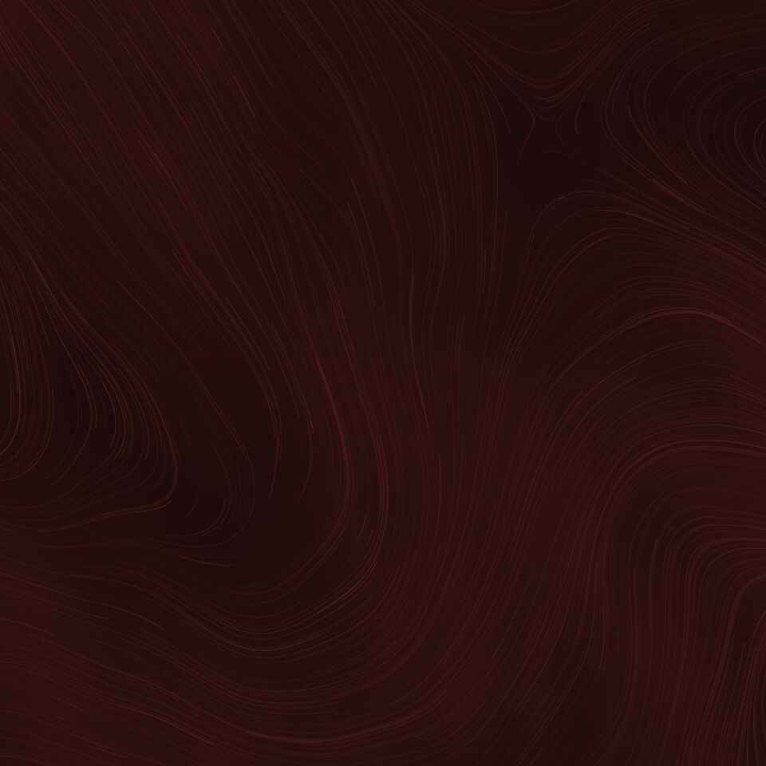

<h1 align="center">Windy Live Wallpaper</h1>

**Android live wallpaper visualizing local wind patterns.**

The shaders are based on the official Pixel windy live wallpaper, but this has:

- Completely rewritten Java code.
- More color schemes.
- Updated wind data (the official data was last updated in 2019).
- Better location handling.
- Lower memory and CPU usage.
- Updated libGDX.
- Other fixes.

[**`Download`**](https://github.com/pgaskin/windy/releases/latest)

#### Screenshots

<table><tbody><tr>
<td></td>
<td></td>
<td></td>
<td></td>
<td></td>
</tr><tr>
<td></td>
<td></td>
<td></td>
<td></td>
<td></td>
</tr></tbody></table>

#### Wind field images

The wind field images used by the live wallpaper are generated from [NOAA GFS](https://www.ncei.noaa.gov/products/weather-climate-models/global-forecast) [0.25° ANL](https://www.nco.ncep.noaa.gov/pmb/products/gfs/) data ([updated](https://www.nco.ncep.noaa.gov/pmb/nwprod/prodstat/) every 6 hours) using the wind vector values ([UGRD, VGRD](https://origin.cpc.ncep.noaa.gov/products/wesley/wgrib2/wind_uv.html)) at 850 mb elevation (this is arbitrary).

The wind vector (in m/s) is extracted from the [GRIB2](https://www.nco.ncep.noaa.gov/pmb/docs/grib2/grib2_doc/) forecast data and mapped into a RGB 8bpp image (equirectangular projection, y: latitude 90° to -90°, longitude -180° to 180°) with one pixel per grid cell (1440x721). The red/green values are the u/v components (east/north) of the unit vector mapped from -1-1 to 0-255, and the blue value is the magnitude of the unit vector clamped and mapped from 0-30 (this value is arbitrary) to 0-255. The image is encoded as a JPEG.

The elevation and wind vector magnitude range I chose seems to produce similar images as the old official one from 2019 (available at [`www.gstatic.com/pixel/livewallpaper/windy/gfs_wind_1000.jpg`](https://www.gstatic.com/pixel/livewallpaper/windy/gfs_wind_1000.jpg)), and the red/green/blue level curves are similar.

To create the texture passed to the particle system and background shaders, the image is scaled down to 1/4 of the size (i.e., 360x180) using bilinear filtering, then blurred using a gaussian kernel of radius 2. This matches what was done by the original live wallpaper. This filtering is done to smooth out the streamlines and remove local outlier values, resulting in less detailed and rounder wallpaper wind trails. Since the wallpaper still looks good, and is interesting in its own way before this filtering, I'm probably going to add variants with an unfiltered wind field later.

See [`windy.api.pgaskin.net/wind_field.jpg`](https://windy.api.pgaskin.net/wind_field.jpg) for the latest wind field image generated by this [code](./api/windy.go), and [`windy.api.pgaskin.net/wind_cache.png?filter=1`](https://windy.api.pgaskin.net/wind_cache.png?filter=1) for the latest filtered texture.
